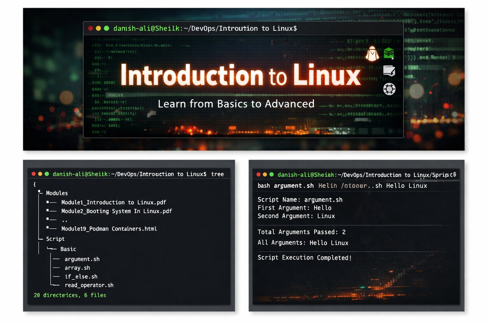
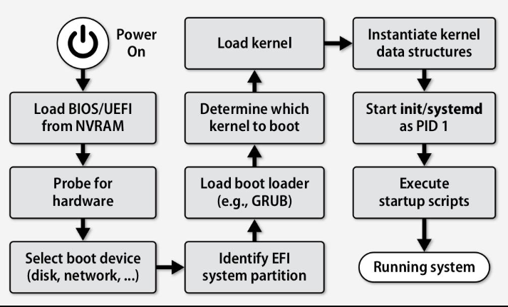
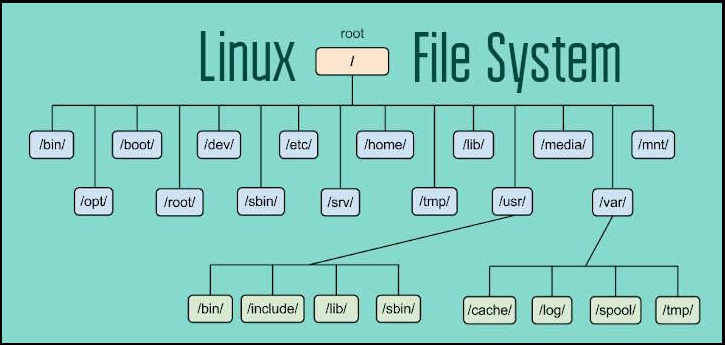
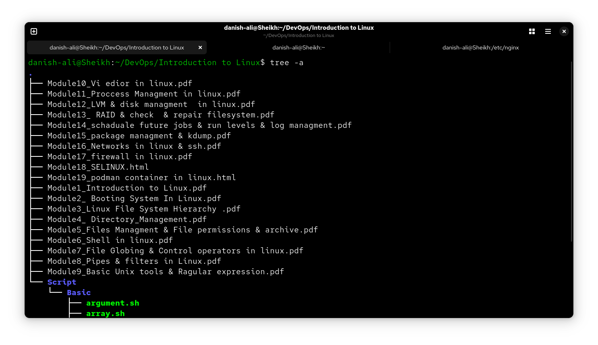

# 🐧 Introduction to Linux: From Fundamentals to Architecture

[](https://www.linux.org/)
[](https://www.gnu.org/software/bash/)
[](https://en.wikipedia.org/wiki/DevOps)



Welcome to my **Linux Administration & DevOps** repository. This project is a curated collection of system architecture diagrams, configuration notes, and automation scripts designed to serve as a comprehensive guide for mastering the Linux environment.

---

## 🏗️ Technical Deep Dive

### 1. The Linux Boot Process
Understanding how a system starts is critical for troubleshooting. This diagram tracks the sequence from hardware initialization to the functional user space.

* **BIOS/UEFI:** Performs POST (Power-On Self-Test).
* **GRUB:** The bootloader that selects the Kernel.
* **Kernel Space:** Loads drivers and mounts the root filesystem.
* **Systemd (PID 1):** The parent process that starts all system services.



### 2. Linux File Hierarchy Standard (FHS)
In Linux, "Everything is a file." This structure ensures consistency across different distributions (Ubuntu, RHEL, CentOS).

* `/etc`: Configuration files (e.g., `named.conf`, `hosts`).
* `/var`: Variable data like logs (`/var/log`) and mail.
* `/bin` & `/sbin`: Essential user and system binaries.
* `/home`: Personal directories for users.



---

## 📂 Repository Contents

I have organized this lab into 19 specialized modules and a dedicated scripting directory.



### 📚 Key Modules Summary
| Module | Focus Area | Detailed Topics |
| :--- | :--- | :--- |
| **01 - 05** | Core Basics | FHS, Permissions, File Management, Archives |
| **06 - 09** | Shell Power | Pipes, Filters, Grep, Regex |
| **10 - 14** | Admin Tasks | Vi/Vim, Process Mgmt, LVM, RAID, Task Scheduling |
| **15 - 19** | Networking & Security | SSH, Firewalls, SELinux, Podman Containers |

---

## 💻 Scripting & Automation

The `Script/Basic` folder contains Bash scripts that automate repetitive tasks.


### Example: Handling Command Line Arguments
```bash
#!/bin/bash
# argument.sh - Accessing inputs passed to the script
echo "Script Name: $0"
echo "First Argument: $1"
echo "Total Arguments: $#"
